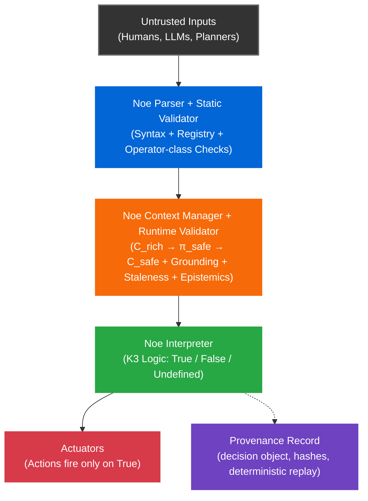

# Noe


**A Deterministic Safety Kernel for Autonomous Systems.**

Noe acts as a deterministic safety boundary between untrusted proposers (humans, LLMs, planners) and critical actuators. Unlike probabilistic models, Noe evaluates each proposal to either a truth value (True/False/Undefined) or a typed Error. Only True can permit execution. False, Undefined, and Error are all non-execution and are distinguishable in the provenance record.

Given the same **chain + registry + semantics + C_safe**, every valid Noe chain has:
- **Exactly one parse**
- **Exactly one meaning** (AST + operator semantics)
- **Exactly one evaluation outcome** across compliant runtimes

<br />

## Why Noe

Modern autonomous systems fail for predictable reasons:

| Problem | Traditional Approach | **Noe** |
|---------|---------------------|---------|
| Ambiguous conditionals | Ad-hoc parsing | ✅ Deterministic grammar |
| Inconsistent interpretation | Per-agent logic | ✅ Cross-agent conformance |
| Stale sensor data | Silent failures | ✅ Explicit `ERR_STALE_CONTEXT` |
| Beliefs treated as facts | Implicit assumptions | ✅ Grounded epistemics |
| LLM hallucinations → actuators | Hope-based validation | ✅ Untrusted proposer + grounding checks + Undefined ⇒ non-execution |
| Agent liability | "Black box" decisions | ✅ Provenance record (SHA-256 hashes + append-only log) |

**In practice:** Planners/LLMs propose → Noe gates → ROS2/controllers execute.

<br />

## Comparison (What Noe Is and Isn't)

Noe is not a planner, a controller, or a robotics middleware. It is a deterministic **decision gate** with explicit epistemics.

| System | What it's good at | Where Noe complements it |
|:---|:---|:---|
| **Behavior Trees (BTs)** | Structured task logic, readable control flow | Validates BT conditions before execution; prevents stale/undefined from propagating |
| **ROS 2 Lifecycle Nodes** | Process/state management, operational reliability | Gates actions before reaching actuators; enforces grounding + staleness |
| **Safety Shields (e.g., barrier functions)** | Real-time constraint enforcement, proven correctness | Adds epistemic layer (knowledge vs belief) and cross-agent determinism |
| **Formal Methods (TLA+, model checking)** | Proving system properties offline | Runtime enforcement with explicit undefined handling + audit trail |
| **Policy engines (OPA/Rego)** | Fast boolean rules, authorization | Three-valued logic (K3), typed epistemics, deterministic replay |
| **LLM tool calling** | Flexible intent generation | Untrusted proposer model: validates claims before execution |

<br />

## Threat Model (Summary)

**Untrusted:** Proposers (LLMs, planners) may hallucinate or lie; upstream sensors may be wrong (garbage in, garbage out).  
**Guaranteed:** Deterministic verdict given matching inputs; explicit failure modes (`ERR_*` codes); reproducible replay artifacts (hashes over chain and C_safe).  
**NOT solved:** Perception accuracy, planning optimality, or liveness. Noe gates; other layers implement recovery.

See [THREAT_MODEL.md](THREAT_MODEL.md) for adversary model, trust boundaries, and security limits.

<br />

## Deterministic Runtime Validator  
Strict runtime validation enforces grounding checks, staleness detection, and typed epistemics (`shi` / `vek` / `sha`). Unsafe, inconsistent, or undefined conditions trigger automatic non-execution. Not formally verified, but deterministically reproducible.


<br />

## Determinism Contract

**What must match for identical outcomes:**

- **Canonical chain encoding**: NFKC normalization of glyph sequence
- **Registry version**: Same operator definitions and semantics (versioned via hash)
- **Semantics version**: Same NIP-005 logic (Strong Kleene, K3 truth tables)
- **Context snapshot hash**: Canonical JSON (sorted keys, stable encoding) → SHA-256 of `C_safe`
- **Runtime mode**: `strict` (no implicit defaults, no seed values)
- **Error taxonomy**: Defined error codes (`ERR_STALE_CONTEXT`, `ERR_CONTEXT_INCOMPLETE`, etc.)

**What Noe does NOT guarantee:**
- Liveness: Noe gates, other layers implement recovery/retries/degraded modes
- Ordering: Concurrent proposals may be evaluated in any order (deterministic per proposal)
- Raw sensor fusion: Combining lidar points + camera pixels + radar into object detections (happens upstream)

**What the Noe stack can include (optional adapters, reference implementations):**
- Temporal stabilizers (hysteresis, debounce) that produce canonical facts for C_safe
- Epistemic mappers (confidence → knowledge/belief/certainty) specified by NIP-016  
- Cross-modal reasoning once those facts are present in C_safe (e.g., `shi @vision an shi @lidar`)

> **Note:** Adapters are not part of the core determinism guarantee unless their outputs are hashed into C_safe.

**Core Safety Invariant:**
```
True  → action fires
False → guard blocks (non-execution)
Undefined → non-execution
Error → non-execution
```

<br />

## Example

```python
from noe import run_noe_logic

# Define context with sensor data and safety constraints
context = {
    "literals": {
        "@safe_zone": True,
        "@obstacle_detected": False,
        "@move": True
    },
    "entities": {
        "@robot": {"position": [0, 0], "velocity": [1, 0]},
        "@goal": {"position": [5, 0]}
    },
    "spatial": {
        "thresholds": {"near": 1.0, "far": 5.0}
    },
    "temporal": {"now": 1000, "max_skew_ms": 100},
    "modal": {
        "knowledge": {"@safe_zone": True},  # Epistemic backing for shi
        "belief": {},
        "certainty": {}
    }
}

# Noe chain demonstrating epistemic operators and safety scoping:
# - "shi @safe_zone": Assert epistemic KNOWLEDGE (requires evidence, not just belief)
# - "an nai @obstacle_detected": Strong Kleene AND + NOT
# - "khi": Conditional guard (action fires only if True)
# - "sek ... sek": Atomic safety scope (first sek opens, second sek closes)
# - "nek": Chain terminator
chain = "shi @safe_zone an nai @obstacle_detected khi sek mek @move sek nek"

# Using 'partial' for demo brevity; 'strict' enforces full context completeness (NIP-009)
result = run_noe_logic(chain, context, mode="partial")
# → {"domain": "action", "verb": "mek", "target": "@move", ...}

# If @safe_zone is uncertain or @obstacle_detected is True:
context["literals"]["@obstacle_detected"] = True
result = run_noe_logic(chain, context, mode="partial")
# → {"domain": "truth", "value": False}  # Guard blocks, no action
```

**Why this matters:**
- `shi` (knowledge) prevents action if evidence is uncertain (unlike belief-based `vek`)
- `sek` creates decision-level atomicity: one evaluation produces one action envelope (actuator-level preemption is handled downstream)
- Strong Kleene logic: `undefined AND True = undefined` (safer than boolean `False`)

> **Note:** Strict mode requires complete context shards (spatial, temporal, modal, axioms). See [examples/](examples/) for full demos.

<br />

## Performance

### Python Reference Runtime (v1.0)

This repository ships a **Python reference runtime**. It prioritizes:
- **Correctness**
- **Deterministic replay**
- **Conformance coverage**
- **Clear audit artifacts**

over real-time performance.

It is intentionally written in a way that is easy to read and validate against the NIP specifications, even when that costs latency.

**Measured (representative):**
- Context snapshot + canonical hash: **4–5ms** (tens of KB contexts, hundreds of entities)
- Parse + validate + eval: **sub-millisecond** when cached and context is already safe-projected

**What this is suitable for in production:**
- ✅ 5–20Hz supervisor gates (deliberative decision checks)
- ✅ Audit and provenance generation
- ✅ Replay and certification pipelines
- ✅ Integration glue around ROS2 and higher-level planners

**What this is NOT suitable for:**
- ❌ Hard real-time control loops
- ❌ Actuator-adjacent safety enforcement with strict jitter bounds
- ❌ High-frequency reactive systems where tail latency matters

**The bottleneck** is not "Python is slow" in the abstract. It is predictable: dict materialization, object allocation, and hashing costs dominate at scale.

**Reproduce:** `python3 benchmarks/bridge_overhead.py`

[Full benchmarks →](benchmarks/)

<br />

## Quick Start

### Install
```bash
pip install -r requirements.txt
```

### Run Tests
```bash
# Unit tests
pytest

# Conformance suite (NIP-011)
cd tests/nip011 && python3 run_conformance.py
```

### Run Demo
```bash
cd examples/auditor_demo
./run_demo.sh
```

<br />

## Architecture



**Key Properties:**
- **Three-valued logic (K3)**: `True`, `False`, `Undefined` → no silent coercion
- **Conditional guard**: `khi` operator (action fires only if condition evaluates to `True`)
- **Epistemic operators**: `shi` (knowledge), `vek` (belief), `sha` (certainty)
- **2-stage context pipeline**: `C_rich → π_safe → C_safe` (all evaluation uses `C_safe`)
- **Strict mode**: No implicit defaults, no fabricated grounding
- **Provenance**: SHA-256 hashes for context + actions + `context_reference` (pointer to stored C_safe snapshot for audit/replay)

[Full architecture specs →](nips/nip_005.md)

<br />

## Repository Structure

```
noe/                    # Core runtime (parser, validator, context manager)
tests/                  # Unit tests + NIP-011 conformance vectors
examples/               # End-to-end demos (auditor, robot guard)
benchmarks/             # Performance validation (latency, determinism)
nips/                   # Specification documents
```

<br />

## Documentation

- **[NIP-005: Core Semantics](nips/nip_005.md)** - Grammar + K3 logic
- **[NIP-009: Context Model](nips/nip_009.md)** - `C_root`, `C_domain`, `C_local`
- **[NIP-011: Conformance](tests/nip011/)** - 75 test vectors
- **[NIP-016: Epistemic Mapping](nips/nip_016_epistemic_mapping.md)** - Confidence scores → modal facts

<br />

## Conformance

A runtime is **Noe-compatible** only if it passes all NIP-011 conformance vectors:

```bash
cd tests/nip011
python3 run_conformance.py
```

Expected output:
```
Total: 75, Passed: 75, Failed: 0
✅ ALL NIP-011 TESTS PASSED
```

**Full test suite:** 82/82 passing (75 NIP-011 conformance + 7 parser adversarial)

<br />

## Production Deployment Model

Noe is designed to be deployed as a **two-tier system**:

### 1. Safety Kernel Runtime (compiled: Rust/C++ required)

- Runs close to actuators and real-time constraints
- Enforces guard evaluation, staleness, grounding, and the `Undefined ⇒ non-execution` invariant
- Must provide tight latency and jitter guarantees
- **Must pass NIP-011 conformance vectors to be considered Noe-compatible**

### 2. Orchestration and Audit Layer (Python is practical)

- Runs alongside planners, LLM proposers, and supervisory logic
- Generates and stores provenance artifacts, certificates, and replay bundles
- Drives conformance testing and serves as the **"spec reference" implementation**

**Boundary enforcement:** In production, the compiled kernel is the only component permitted to authorize actions. Python may propose, audit, replay, and orchestrate, but it cannot directly trigger actuators.

This split is normal in robotics and safety systems: high-level orchestration can be dynamic and slower, but actuator-adjacent enforcement must be compiled and predictable.

<br />

## Known Limitations & Roadmap

### v1.0 Reference Implementation Limitations (Python)

- **Snapshot cost**: Full context merging and canonical hashing are O(N) in context size
- **Allocation overhead**: Python object churn dominates at larger contexts
- **Jitter**: Python cannot credibly guarantee tight real-time bounds under load
- **No structural sharing**: Each snapshot is independent to preserve immutability and replay clarity

### v1.1 Python Optimization Path (Quality-of-life, not a substitute for C++)

**Target:** Reduce snapshot overhead for higher-rate supervisor loops, without changing semantics.

**Approach:**
- Lazy merged view (no per-tick merged dict)
- Path-selective π_safe extraction (only AST-required paths)
- Rebuild local context per tick (avoid deep-copy)

This improves throughput for orchestration and supervisor use cases. **It does not change the fundamental reality:** Python remains the reference and orchestration tier, not the actuator-tier safety kernel.

### Production Kernel (Rust/C++)

The production-grade Noe runtime should be implemented in **Rust or C++** for:
- Deterministic latency and bounded jitter
- Efficient structural sharing (copy-on-write)
- Predictable memory behavior
- Fast canonical hashing

**Requirement:** Any production port is only valid if it passes the same conformance vectors and produces identical outputs for identical inputs under the Noe determinism contract.

> **Roadmap:** See [ROADMAP.md](ROADMAP.md) for Rust/C++ kernel implementation timeline and contribution opportunities.

<br />

## Contributing

Contributions must:
- Preserve **Strong Kleene (K3)** semantics
- Pass all conformance tests (`tests/nip011/`)
- Include unit tests for new features
- Not fabricate context (adapters filter/stabilize only)

See [CONTRIBUTING.md](CONTRIBUTING.md) for details.

<br />

## License

Apache 2.0 - see [LICENSE](LICENSE)

<br />

## Contact

- **Issues**: [github.com/noe-protocol/noe/issues](../../issues)
- **Discussions**: [github.com/noe-protocol/noe/discussions](../../discussions)
