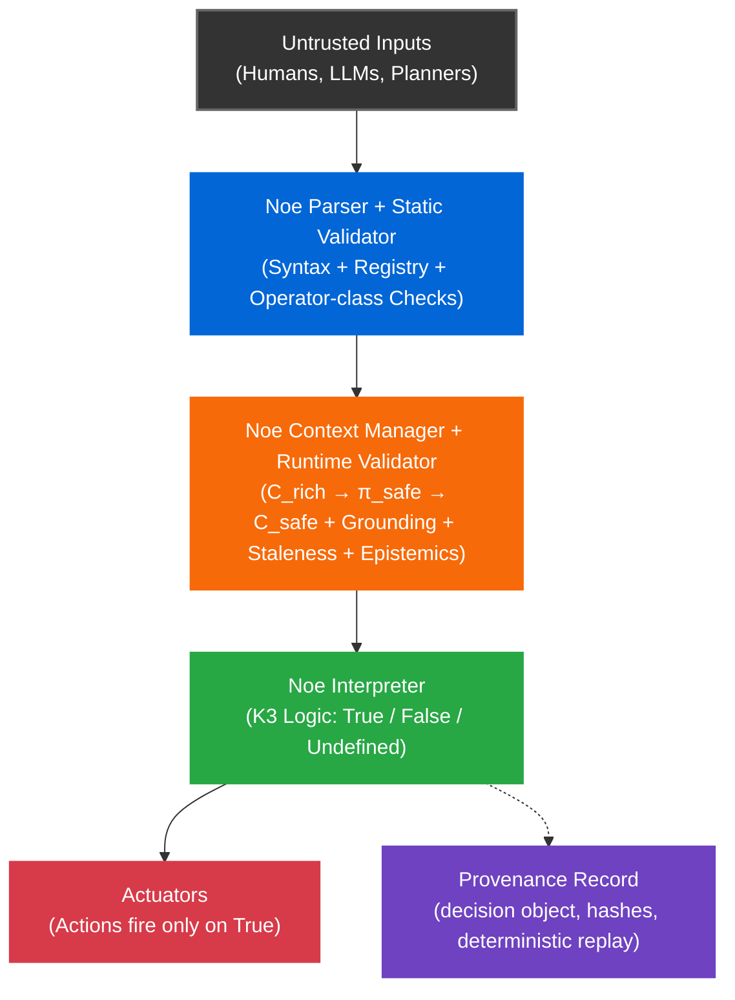

# Noe


**A Deterministic Decision Kernel for Autonomous Systems.**

Noe acts as a deterministic decision enforcement boundary between untrusted proposers (humans, LLMs, planners) and critical actuators for embodied AI. Unlike probabilistic models, Noe evaluates each proposal to either a truth value (True/False/Undefined) or a typed Error. Only True can permit execution. False, Undefined, and Error are all non-execution and are distinguishable in the provenance record. Noe is not a control loop. It gates high-level decisions; a lower-level controller/reflex layer is responsible for keeping the system safe when actions are blocked.

Given the same **chain + registry + semantics + C_safe**, every valid Noe chain has:
- **Exactly one parse**
- **Exactly one meaning** (AST + operator semantics)
- **Exactly one evaluation outcome** across compliant runtimes

<br />

## Why Noe

Modern autonomous systems fail for predictable reasons:

| Problem | Traditional Approach | **Noe** |
|---------|---------------------|---------|
| Ambiguous conditionals | Ad-hoc parsing | ✅ Deterministic grammar |
| Inconsistent interpretation | Per-agent logic | ✅ Cross-agent conformance |
| Stale sensor data | Silent failures | ✅ Explicit `ERR_STALE_CONTEXT` |
| Beliefs treated as facts | Implicit assumptions | ✅ Grounded epistemics |
| LLM hallucinations → actuators | Hope-based validation | ✅ Untrusted proposer + grounding checks + Undefined ⇒ non-execution |
| Agent liability | "Black box" decisions | ✅ Provenance record (SHA-256 hashes + append-only log) |

**In practice:** Planners/LLMs propose → Noe gates → ROS2/controllers execute.

<br />

## Comparison (What Noe Is and Isn't)

Noe is not a planner, a controller, or a robotics middleware. It is a deterministic **decision kernel** with explicit epistemics.

| System | What it's good at | Where Noe complements it |
|:---|:---|:---|
| **Behavior Trees (BTs)** | Structured task logic, readable control flow | Validates BT conditions before execution; prevents stale/undefined from propagating |
| **ROS 2 Lifecycle Nodes** | Process/state management, operational reliability | Gates actions before reaching actuators; enforces grounding + staleness |
| **Safety Shields (e.g., barrier functions)** | Real-time constraint enforcement, proven correctness | Adds epistemic layer (knowledge vs belief) and cross-agent determinism |
| **Formal Methods (TLA+, model checking)** | Proving system properties offline | Runtime enforcement with explicit undefined handling + audit trail |
| **Policy engines (OPA/Rego)** | Fast boolean rules, authorization | Three-valued logic (K3), typed epistemics, deterministic replay |
| **LLM tool calling** | Flexible intent generation | Untrusted proposer model: validates claims before execution |

<br />

## Threat Model (Summary)

**Untrusted:** Proposers (LLMs, planners) may hallucinate or lie; upstream sensors may be wrong (garbage in, garbage out).  
**Guaranteed:** Deterministic verdict given matching inputs; explicit failure modes (`ERR_*` codes); reproducible replay artifacts (hashes over chain and C_safe).  
**NOT solved:** Perception accuracy, planning optimality, or liveness. Noe gates; other layers implement recovery.


### Liability Infrastructure

Noe makes agent decisions replayable and auditable. For each proposal, it produces a deterministic verdict plus an integrity-protected record (chain, `C_safe`, result, hashes). This supports incident investigation, compliance workflows, and insurer-grade logging.

**What Noe provides:**
- Deterministic evaluation: identical inputs → identical verdict
- Cryptographic integrity: tamper-evident provenance hashes
- Replay capability: re-evaluate past decisions from frozen context

**What Noe does NOT provide:**
- Guarantees of perception accuracy (sensor correctness is upstream)
- System-level safety guarantees (liveness, fault tolerance handled by other layers)
- Legal liability determination (Noe generates evidence, not verdicts on culpability)

**Incident analysis:** Noe can demonstrate the policy was evaluated correctly relative to the recorded context and can help isolate whether a failure is upstream perception, stale context, or policy logic. It does not determine legal liability.

See [THREAT_MODEL.md](THREAT_MODEL.md) for adversary model, trust boundaries, and security limits.

<br />

## Epistemic Operators: Syntactic Type System

Noe's epistemic operators (`shi`/`vek`/`sha`) enforce **explicit classification at the grammar level**, not deep reasoning:

- `shi @safe`: Action fires only if `@safe` has backing in `modal.knowledge`
- `vek @safe`: Action can fire on belief (weaker guarantee)
- `sha @safe`: Action requires certainty

**What Noe does NOT do:**
- Verify sensor provenance automatically
- Reason about knowledge philosophically  
- Infer confidence from raw data

**What Noe DOES do:**
- Force engineers to classify each variable as knowledge/belief/certainty
- Prevent accidental treatment of 60% confidence as fact
- Make epistemic assumptions explicit in the decision chain

This is a **syntactic type system** that prevents lazy engineering, not AI-based epistemic reasoning.

<br />

## Determinism Contract

**What must match for identical outcomes:**

- **Canonical chain encoding**: NFKC normalization of glyph sequence
- **Registry version**: Same operator definitions and semantics (versioned via hash)
- **Semantics version**: Same NIP-005 logic (Strong Kleene, K3 truth tables)
- **Context snapshot hash**: Canonical JSON (sorted keys, stable encoding) → SHA-256 of `C_safe`
- **Runtime mode**: `strict` (no implicit defaults, no seed values)
- **Error taxonomy**: Defined error codes (`ERR_STALE_CONTEXT`, `ERR_CONTEXT_INCOMPLETE`, etc.)

**What Noe does NOT guarantee:**
- Liveness: Noe gates, other layers implement recovery/retries/degraded modes
- Ordering: Concurrent proposals may be evaluated in any order (deterministic per proposal)
- Raw sensor fusion: Combining lidar points + camera pixels + radar into object detections (happens upstream)

**What the Noe stack can include (optional adapters, reference implementations):**
- Temporal stabilizers (hysteresis, debounce) that produce canonical facts for C_safe
- Epistemic mappers (confidence → knowledge/belief/certainty) specified by NIP-016  
- Cross-modal reasoning once those facts are present in C_safe (e.g., `shi @vision an shi @lidar`)

> **Note:** Adapters are not part of the core determinism guarantee unless their outputs are hashed into C_safe.

**Core Safety Invariant:**
```
True  → action fires
False → guard blocks (non-execution)
Undefined → non-execution
Error → non-execution
```

### Why Strong Kleene (K3) Logic?

Noe uses **K3** (Strong Kleene) three-valued logic, not Weak Kleene or boolean logic.

**K3 semantics:**
- `True AND Undefined = Undefined` (conservative)
- `True OR Undefined = True` (optimistic)
- `NOT Undefined = Undefined` (propagates)

**Rationale:**
- **Emergency stop:** `(@stop_button) ur (@sensor_glitch)` 
  - If stop button is True, action SHOULD fire regardless of sensor state
  - Weak Kleene would block valid emergency commands due to unrelated sensor failures

**Safety pattern:**
- **Critical guards MUST use conjunctions:** `shi @safe an nai @obstacle`
- **Disjunctions are for fallbacks only:** `@primary_sensor ur @backup_sensor`
- **Guard rule:** If a condition authorizes motion, do not use `ur` unless each disjunct independently implies safety under strict completeness requirements.

> **Linting Rule:** In strict mode, `ur` inside a `khi` guard triggers a warning by default and should be treated as an error unless explicitly allowlisted.

## Example

```python
from noe import run_noe_logic

# Define context with sensor data and safety constraints
context = {
    "literals": {
        "@safe_zone": True,
        "@obstacle_detected": False,
        "@move": True
    },
    "entities": {
        "@robot": {"position": [0, 0], "velocity": [1, 0]},
        "@goal": {"position": [5, 0]}
    },
    "spatial": {
        "thresholds": {
            "near_um": 1000000,  # 1.0m in micrometers
            "far_um": 5000000    # 5.0m in micrometers
        }
    },
    "temporal": {"now_us": 1000000, "max_skew_us": 100000},  # microseconds
    "modal": {
        "knowledge": {"@safe_zone": True},  # Epistemic backing for shi
        "belief": {},
        "certainty": {}
    }
}

# Noe chain demonstrating epistemic operators and safety scoping:
# - "shi @safe_zone": Assert epistemic KNOWLEDGE (requires evidence, not just belief)
# - "an nai @obstacle_detected": Strong Kleene AND + NOT
# - "khi": Conditional guard (action fires only if True)
# - "sek ... sek": Atomic safety scope (first sek opens, second sek closes)
# - "nek": Chain terminator
chain = "shi @safe_zone an nai @obstacle_detected khi sek mek @move sek nek"

# Using 'partial' for demo brevity; 'strict' enforces full context completeness (NIP-009)
result = run_noe_logic(chain, context, mode="partial")
# → {"domain": "action", "verb": "mek", "target": "@move", ...}

# If @safe_zone is uncertain or @obstacle_detected is True:
context["literals"]["@obstacle_detected"] = True
result = run_noe_logic(chain, context, mode="partial")
# → {"domain": "truth", "value": False}  # Guard blocks, no action
```

**Why this matters:**
- `shi` (knowledge) prevents action if evidence is uncertain (unlike belief-based `vek`)
- `sek` creates decision-level atomicity: one evaluation produces one action envelope (actuator-level preemption is handled downstream)
- Strong Kleene logic: `undefined AND True = undefined` (safer than boolean `False`)

> **Note:** Strict mode requires complete context shards (spatial, temporal, modal, axioms). See [examples/](examples/) for full demos.

<br />

## 🛡️ Decision Kernel v1.0 (Verified)

Noe v1.0 implements a centralized **decision kernel** that guarantees the following properties (verified by `tests/test_safety_kernel_invariants.py`):

1. **Centralized Finalization**: Every action constructor (`mek`, `men`, `vus`, `vel`, `noq`) routes through a single `_finalize_action` choke point.
2. **Deterministic Hashing**:
    - `action_hash` captures **proposal identity** (stable across contexts/executions).
    - `event_hash` captures **execution identity** (includes outcomes).
    - `event_hash == action_hash` iff no outcome fields are present.
3. **Provenance Completeness**: `provenance.context_hash` matches `meta.context_hash` for the same evaluation.
4. **DAG Integrity**: Action DAGs use `action_hash` as stable node IDs; cycle detection is enforced in strict mode.

### Verification Suite
- `python tests/nip011/run_conformance.py` → **60/60 PASS**

## 🔒 Determinism Contract

Noe v1.0 guarantees output determinism based on canonical inputs:

1. **Chain hashing:** Every Noe chain has a unique canonical text representation. Hash-identical chains are semantically identical.
2. **Context snapshot hash:** SHA-256(RFC8785_CanonicalJSON(C_safe))
3. **Action/Event hashing:** See [NIP-005](nips/nip_005_action_hashing.md) for the deterministic hashing spec.

**Determinism guarantees:**
- Platform-independent: Same inputs → same outputs on x86, ARM, WASM
- Language-independent: Python, Rust, C++ produce identical results (given compliant implementations)
- Replay stability: Re-evaluating a chain against the same context always produces the same outcome

**Scope:** Bit-perfect determinism is guaranteed at the kernel boundary: identical C_safe (int64-only) + identical chain/registry/semantics ⇒ identical outputs. Adapter quantization is normative when its outputs are hashed into C_safe.

<br />
### Numeric Policy (Strict)

**Reality:** Upstream sensors and planners emit floats.

**v1.0 Decision Kernel contract:** `C_safe` contains **only canonical int64 values** for safety-relevant quantities.

**Quantization boundary:** Sensor adapters MUST quantize floats → int64 **before** submitting to `π_safe`.  
The decision kernel does NOT perform quantization - it validates that incoming values are already integers.

**Allowed types in C_safe:**
- `true` / `false`
- `string` (UTF-8)
- `integer` in signed 64-bit range: `[-2^63, 2^63 - 1]`
- arrays/objects composed only of the above

**Validation (not quantization):**
- **Deep validation:** Kernel rejects any JSON float anywhere in `C_safe` (including nested arrays/objects)
- If a safety-relevant field is a float → `ERR_INVALID_NUMBER`
- If an integer is outside int64 range → `ERR_INTEGER_RANGE`
- `NaN` / `Inf` anywhere → `ERR_INVALID_NUMBER`

**Sensor adapter responsibility:**
- Quantize floats using deterministic decimal arithmetic (e.g., Python `Decimal`, Rust `rust_decimal`)
- **Input format:** Quantize from raw decimal string (not binary float), whenever possible
- **Rounding mode:** Round-to-nearest, ties-to-even (IEEE 754 default)
- **Standard scales:** 1e6 for position/velocity (micrometers, µm/s), timestamps in microseconds
- **Full specification:** See [NIP-009 §3](nips/nip_009.md#3-numeric-policy-strict-integer-only-c_safe) for:
  - Accepted numeric string formats (decimal, scientific notation, edge cases)
  - Exact quantization formula with examples
  - Adapter conformance table (normative test vectors)
  - Float rejection semantics

**Adapter conformance requirement:**
- **Adapters are part of the determinism contract** when their outputs are hashed into `C_safe`
- A compliant Noe deployment must produce `C_safe` integers via the adapter quantization spec (NIP-009)
- Different adapter implementations must produce identical `C_safe` for identical raw sensor data

**Why push quantization upstream:**
- Eliminates float arithmetic from decision kernel (zero portability risk)
- Sensor adapters choose their decimal library
- Decision kernel stays simple: type validation only
- Testable boundary: adapters prove quantization correctness via conformance vectors

**Canonicalization and hashing:**
- `context_hash = SHA-256( RFC8785_CanonicalJSON(C_safe) )`
- `C_safe` contains ONLY int64 → perfect cross-platform determinism

### Python Reference Runtime (v1.0)

This repository ships a **Python reference runtime**. It prioritizes:
- **Correctness**
- **Deterministic replay**
- **Conformance coverage**
- **Clear audit artifacts**
over real-time performance.

It is intentionally written in a way that is easy to read and validate against the NIP specifications, even when that costs latency.

<br />

## Quick Start

### Install
```bash
pip install -r requirements.txt
```

### Run Tests
```bash
# Unit tests
pytest

# Conformance suite (NIP-011)
cd tests/nip011 && python3 run_conformance.py
```

### Run Demo
```bash
cd examples/auditor_demo
./run_demo.sh
```

<br />

## Architecture



**Key Properties:**
- **Three-valued logic (K3)**: `True`, `False`, `Undefined` → no silent coercion
- **Conditional guard**: `khi` operator (action fires only if condition evaluates to `True`)
- **Epistemic operators**: `shi` (knowledge), `vek` (belief), `sha` (certainty)
- **2-stage context pipeline**: `C_rich → π_safe → C_safe` (all evaluation uses `C_safe`)
- **Strict mode**: No implicit defaults, no fabricated grounding
- **Provenance**: SHA-256 hashes for context + actions + `context_reference` (pointer to stored C_safe snapshot for audit/replay)

[Full architecture specs →](nips/nip_005.md)

<br />

## Repository Structure

```
noe/                    # Core runtime (parser, validator, context manager)
tests/                  # Unit tests + NIP-011 conformance vectors
examples/               # End-to-end demos (auditor, robot guard)
benchmarks/             # Performance validation (latency, determinism)
nips/                   # Specification documents
```

<br />

## Documentation

- **[NIP-005: Core Semantics](nips/nip_005.md)** - Grammar + K3 logic
- **[NIP-009: Context Model](nips/nip_009.md)** - `C_root`, `C_domain`, `C_local`
- **[NIP-011: Conformance](tests/nip011/)** - 60/60 vectors passing
- **[NIP-016: Epistemic Mapping](nips/nip_016_epistemic_mapping.md)** - Confidence scores → modal facts

<br />

## Conformance

A runtime is **Noe-compatible** only if it passes all NIP-011 conformance vectors:

```bash
cd tests/nip011
python3 run_conformance.py
```

Expected output:
```
Executed: 60, Passed: 60, Failed: 0
✅ ALL EXECUTED TESTS PASSED
```

**NIP-011 Conformance Coverage:**
- Adversarial inputs: 10 tests
- Epistemic operators: 11 tests  
- Cross-agent coordination: 5 tests
- Miscommunication prevention: 6 tests
- Staleness detection: 4 tests
- Spatial operators: 2 tests
- Demonstratives: 5 tests
- Literals: 3 tests
- Audit subsystem: 2 tests
- Context handling: 3 tests
- Delivery actions: 1 test
- Request actions: 1 test
- Strict mode: 1 test
- Strict actions: 2 tests
- Ungrounded references: 4 tests

**Total: 60 conformance tests passing**

> **Normative Standard:** The NIP specifications plus the NIP-011 conformance vectors define the standard. The Python runtime is an executable reference, not the standard itself.

<br />

## Production Deployment Model

Noe is designed to be deployed as a **two-tier system**:

### 1. Decision Kernel Runtime (Rust/C++ required)

- Runs close to actuators and real-time constraints
- Enforces guard evaluation, staleness, grounding, and the `Undefined ⇒ non-execution` invariant
- Must provide tight latency and jitter guarantees
- **Must pass NIP-011 conformance vectors to be considered Noe-compatible**

### 2. Orchestration and Audit Layer (Python is practical)

- Runs alongside planners, LLM proposers, and supervisory logic
- Generates and stores provenance artifacts, certificates, and replay bundles
- Drives conformance testing and serves as the **"spec reference" implementation**

**Boundary enforcement:** In production, the compiled kernel is the only component permitted to authorize actions. Python may propose, audit, replay, and orchestrate, but it cannot directly trigger actuators.

This split is normal in robotics and safety systems: high-level orchestration can be dynamic and slower, but actuator-adjacent decision enforcement must be compiled and predictable.

<br />

## Known Limitations & Roadmap

### v1.0 Reference Implementation Limitations (Python)

- **Snapshot cost**: Full context merging and canonical hashing are O(N) in context size
- **Allocation overhead**: Python object churn dominates at larger contexts
- **Jitter**: Python cannot credibly guarantee tight real-time bounds under load
- **No structural sharing**: Each snapshot is independent to preserve immutability and replay clarity

### v1.1 Python Optimization Path (Quality-of-life, not a substitute for C++)

**Target:** Reduce snapshot overhead for higher-rate supervisor loops, without changing semantics.

**Approach:**
- Lazy merged view (no per-tick merged dict)
- Path-selective π_safe extraction (only AST-required paths)
- Rebuild local context per tick (avoid deep-copy)

This improves throughput for orchestration and supervisor use cases. **It does not change the fundamental reality:** Python remains the reference and orchestration tier, not the actuator-tier decision kernel.

### Production Kernel (Rust/C++)

The production-grade Noe runtime should be implemented in **Rust or C++** for:
- Deterministic latency and bounded jitter
- Efficient structural sharing (copy-on-write)
- Predictable memory behavior
- Fast canonical hashing

**Requirement:** Any production port is only valid if it passes the same conformance vectors and produces identical outputs for identical inputs under the Noe determinism contract.

> **Roadmap:** See [ROADMAP.md](ROADMAP.md) for Rust/C++ kernel implementation timeline and contribution opportunities.

<br />

## Contributing

Contributions must:
- Preserve **Strong Kleene (K3)** semantics
- Pass all conformance tests (`tests/nip011/`)
- Include unit tests for new features
- Not fabricate context (adapters filter/stabilize only)

See [CONTRIBUTING.md](CONTRIBUTING.md) for details.

<br />

## License

Apache 2.0 - see [LICENSE](LICENSE)


## Contact

- **Issues**: [github.com/noe-protocol/noe/issues](../../issues)
- **Discussions**: [github.com/noe-protocol/noe/discussions](../../discussions)
