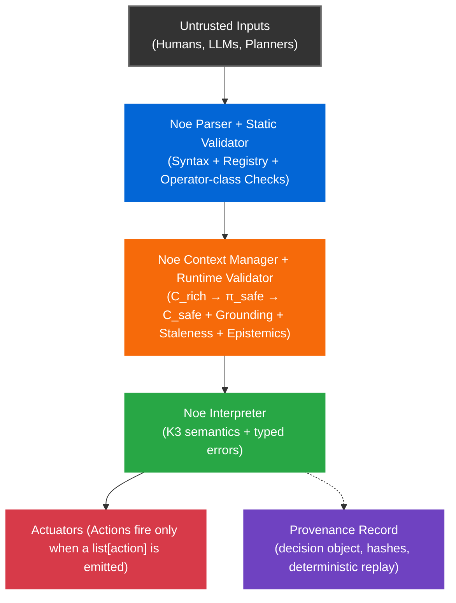

# Noe

**A deterministic decision kernel for autonomous systems.**

Noe is an **enforcement boundary** between *untrusted proposers* (humans, LLMs, planners) and *critical actuators* (robots, industrial automation). A proposer suggests an action; Noe evaluates a small, deterministic policy chain against a frozen, grounded context (`C_safe`) and returns either:

- **`list[action]`** → permitted (action proposal emitted)
- **`undefined`** → condition not satisfied / guard fell through (no-op)
- **`error`** → strict-mode violation, e.g. `ERR_EPISTEMIC_MISMATCH`, `ERR_CONTEXT_STALE` (refusal; reason recorded in certificate when provenance is enabled)

Only an emitted action is eligible for execution. **`undefined` and `error` are both non-execution**, and are distinguishable in the provenance record. `undefined` is a benign fall-through (expected); `error` indicates a violated safety contract and should be surfaced to supervision.

**Scope:** Noe gates discrete, safety-relevant decisions. It is **not** a control loop. A downstream supervisor/reflex layer must implement the configured fallback (hold/slow/stop).
Noe is fail-stop by design: it prevents unauthorized actions; liveness (retry, fallback, recovery) is handled by the downstream supervisor.

<br />

**Contents:** 
1. [Why Noe exists](#why-noe-exists)
2. [Determinism and replay](#determinism-and-replay)
3. [Quick Start](#quick-start)
4. [Certificates](#what-a-certificate-looks-like)
5. [Error codes](#representative-strict-mode-error-codes)
6. [Operator cheat sheet](#operator-cheat-sheet)
7. [Liability Infrastructure](#liability-infrastructure)
8. [Determinism Contract](#determinism-contract-integer-only)
9. [Architecture](#architecture)
10. [Docs](#documentation)

<br />

## Why Noe exists

Most autonomy failures become liability failures because the system cannot prove **what it knew**, **what it decided**, and **why**. Noe turns "why did it move?" into a **replayable evidence object**: the chain, the grounded context snapshot, and a deterministic verdict with hash commitments.

| Problem | Traditional Approach | **Noe Solution** |
|---------|---------------------|------------------|
| **Ambiguous conditionals** | Ad-hoc Python `if` statements | Deterministic grammar |
| **Stale sensor data** | Silent failures / race conditions | Explicit error codes (`ERR_*`) |
| **Beliefs treated as facts** | Implicit assumptions | Grounded epistemics (`knowledge` vs `belief`) |
| **LLM hallucinations** | Hope-based validation | Untrusted proposer model (no action unless permitted) |
| **Incident investigation** | "The AI messed up" (unprovable) | Evidence generation (SHA-256 provenance record) |

<br />

## Determinism and replay

Given the same **chain + registry + semantics + `C_safe`**, any conformance-passing runtime ([NIP-011](tests/nip011/), `noe-canonical-v1`) produces:

- exactly one parse,
- exactly one meaning,
- exactly one evaluation outcome (bit-identical for normative commitments).

Noe enforces an **integer-only** contract for all normative commitments - every `*_hash` field is float-free. Floats are permitted in observational context snapshots. Sensor/planner adapters must quantize at the boundary before projection (`π_safe`).

`π_safe` is a deterministic projection: it prunes stale inputs, applies grounding thresholds, and emits the minimal `C_safe` that the evaluator is allowed to see. Hysteresis/debounce belongs in the grounding adapter (pre-`π_safe`); Noe only consumes the grounded predicate membership.

**Epistemic enforcement:** `shi` / `vek` membership is **not** accepted from the proposer. The runtime derives (or verifies) epistemic membership from **trusted sensor evidence** (signed sensor frames or a trusted adapter that attests the grounding result). If a chain asserts knowledge/belief that is not supported by the attested evidence in `C_safe`, strict mode returns `ERR_EPISTEMIC_MISMATCH`.

`undefined` is a semantic evaluation value; `error` is a strict-mode contract rejection emitted by the validator/runtime.

<br />

## Quick Start

**Requirements**
- Python 3.11 recommended (3.10 supported)
- macOS, Linux, or Windows (via WSL2 recommended)
- `make` installed
- On Windows, use WSL2 for a Linux-native dev environment (recommended).

```bash
git clone https://github.com/noe-protocol/noe.git
cd noe

python3.11 -m venv .venv
source .venv/bin/activate

python -m pip install --upgrade pip
python -m pip install ".[dev]"

make conformance
make demo
make all
```
<br />

### Windows (recommended): WSL2 / Ubuntu
```
# 1) Install WSL2 + Ubuntu, then open an Ubuntu terminal
# 2) Install build tools
sudo apt update
sudo apt install -y make git python3.11 python3.11-venv python3-pip

git clone https://github.com/noe-protocol/noe.git
cd noe

python3.11 -m venv .venv
source .venv/bin/activate

python -m pip install --upgrade pip
python -m pip install ".[dev]"

make conformance
make demo
make all
```
<br />

For development workflows, replace python -m pip install ".[dev]" with python -m pip install -e ".[dev]".

<br />

## One-minute example

```
shi @human_present khi sek mek @stop sek nek
```

- `shi` = knowledge check
- `khi` = guard (if…then)
- `sek` = explicit scope boundary (required for `khi` action blocks)
- `mek` = action verb
- `nek` = chain terminator

Identifiers like `@human_present` and `@stop` are registry keys (see `noe/registry.json` for identifier kinds/types).

Illustrative (domain-pack style): sources/thresholds live in the active Domain Pack; the core registry fixes identifier kinds/types.

Note: `shi @human_present` must be grounded from **attested sensor evidence** (or a trusted adapter result). Proposer-supplied claims do not satisfy `shi` / `vek`.

```json
{
  "@human_present":  { "kind": "literal", "shard": "modal.knowledge", "source": "vision.person_bbox", "threshold": 0.90 },
  "@e_stop_pressed": { "kind": "literal", "shard": "modal.knowledge", "source": "hw.estop" },
  "@stop":           { "kind": "action",  "verb": "mek", "action_class": "safety_stop" }
}
```
- If `@human_present` is grounded **true** in `C_safe.modal.knowledge` → emits `mek @stop`
- If grounded **false** → `undefined` (no-op)
- If missing/ungrounded in strict mode → `error: ERR_EPISTEMIC_MISMATCH` (refusal; reason recorded in certificate when provenance is enabled)

### One-minute example (compound)

```
shi @human_present ur shi @e_stop_pressed khi sek mek @stop sek nek
```

- `ur` = disjunction (OR)
- If **either** `shi @human_present` **or** `shi @e_stop_pressed` is grounded **true** in `C_safe` → emits `mek @stop`
- If **both** are grounded **false** → `undefined` (no-op)
- If a predicate is missing/ungrounded in strict mode → `error` (strict-mode contract rejection)

Propagation rules for `ur` over `undefined` are normative in **NIP-005**.

**[Full Auditor Demo Walkthrough](examples/auditor_demo/README.md)**

<br />

### Common Commands

```bash
make test          # Unit tests
make conformance   # NIP-011 conformance vectors
make guard         # Robot guard golden-vector demo (7 ticks)
make demo          # Full auditor demo
make bench         # ROS bridge overhead benchmark
make all           # Run everything
make help          # Show all available targets
```

**In practice:** Planners/LLMs propose → Noe gates → ROS2/controllers execute.

<br />

### Conformance Integrity Notes (NIP-011)

`make conformance` verifies that each test vector is byte-exact against a locked
SHA-256 manifest. An integrity failure means the JSON file on disk does **not**
match the recorded hash.

If a test vector is intentionally modified, the corresponding hashes **must be
updated in both**:

- `tests/nip011/nip011_manifest.json`
- `tests/nip011/conformance_pack_v1.0.0.json`

Integrity failures indicate a spec or test change, **not a runtime bug**, and
must be resolved by updating the manifests and committing them together.

The conformance runner aborts on any mismatch by design.

<br />

### What a certificate looks like

Every decision produces a JSON certificate with hash commitments. Example (truncated):

```json
{
  "noe_version": "v1.0-rc1",
  "chain": "shi @temperature_ok an shi @human_clear khi sek mek @release_pallet sek nek",
  "registry": {
    "path": "noe/registry.json",
    "hash": "9c2c1e4a8b6d5f2a1d9e3c4b7a6f0e11",
    "commit": "git:3f2a1c9"
  },
  "context_hashes": {
    "root":   "4802862d...4d74",
    "domain": "8d84e2f1...3c90",
    "local":  "f83bb963...7264",
    "safe":   "4b766825...dbbf"
  },
  "outcome": {
    "domain": "list",
    "value": [{
      "type": "action",
      "verb": "mek",
      "target": "@release_pallet",
      "action_hash": "3031cedd...f00b"
    }]
  }
}
```

An auditor can replay: freeze the context, re-evaluate the chain, and verify the hashes match. See a full example at [shipment_certificate_strict.json](examples/auditor_demo/shipment_certificate_strict.json).

Store certificates in an append-only log; auditors verify by recomputing `context_hashes.safe` and replaying the chain against `context_snapshot.safe`.

Certificates explicitly bind the runtime’s registry by hash (and optional source commit), so auditors replay against the exact identifier → type mapping used at decision time. This prevents cross-agent ambiguity when the same symbolic identifiers exist in multiple registries. Certificates may also bind the **evidence provenance** (e.g., sensor-frame hash / adapter attestation hash) so auditors can verify epistemic grounding was derived from attested inputs rather than proposer claims.
<br />

### Representative strict-mode error codes

| Code | Meaning | Supervisor action |
|------|---------|-------------------|
| `ERR_CONTEXT_STALE` | Sensor data exceeds staleness threshold | Refresh context, retry |
| `ERR_EPISTEMIC_MISMATCH` | Chain claims knowledge not in context | Check sensor pipeline |
| `ERR_ACTION_MISUSE` | Action verb outside guarded block | Fix chain structure |
| `ERR_LITERAL_MISSING` | `@literal` not in context shard | Populate `C.literals` |
| `ERR_BAD_CONTEXT` | Context is null/array/malformed | Fix context construction |
| `ERR_CONTEXT_INCOMPLETE` | Required shard missing (temporal, modal, etc.) | Add missing shard |

Full list: [docs/error_codes.md](docs/error_codes.md)

<br />

### Operator cheat sheet

| Operator | Role | Example |
|----------|------|---------|
| `shi` | Knowledge check ("I know X") | `shi @door_open` |
| `vek` | Belief check ("I believe X") | `vek @path_clear` |
| `an` | Conjunction (AND) | `shi @a an shi @b` |
| `ur` | Disjunction (OR) | `shi @a ur shi @b` |
| `nai` | Negation (NOT) | `nai (shi @danger)` |
| `khi` | Guard (if…then) | `shi @safe khi sek mek @go sek nek` |
| `sek` | Explicit scope boundary | `sek mek @action sek` |
| `nek` | Chain terminator | `... sek nek` |
| `mek` | Action (do) | `mek @release_pallet` |
| `men` | Audit action (log) | `men @safety_check` |

<br />

## Liability Infrastructure

Noe makes agent decisions replayable and auditable. For each proposal, it produces a deterministic verdict plus an integrity-protected record. This supports incident investigation, compliance workflows, and audit-grade evidence.

**What Noe provides:**

* **Deterministic evaluation:** Identical inputs → Identical verdict (Int64 only).
* **Cryptographic integrity:** Tamper-evident provenance hashes.
* **Replay capability:** Re-evaluate past decisions from frozen context.

**What Noe does NOT provide:**

* Guarantees of perception accuracy (sensor correctness is upstream).
* System-level safety guarantees (liveness is downstream).
* Legal liability determination (Noe generates *evidence*, not verdicts).

See [THREAT_MODEL.md](THREAT_MODEL.md) for adversary model, trust boundaries, and security limits.

<br />

## The LLM Problem: Safety Floors

Large Language Models (LLMs) are probabilistic. You cannot "replay" a neural network's thought process cryptographically.

Noe creates a **Safety Floor**: a deterministic, symbolic validation layer that sits *below* the LLM.

* **LLM Proposer:** *"I think we should release the pallet."*
* **Noe Kernel:** *"Checking bounds... Rejection. Confidence 0.85 < Threshold 0.90 (Knowledge)."*
* **Result:** Safe Halt.

This turns LLMs into **Untrusted Proposers**, preventing hallucinations from becoming kinetic actions.

<br />

## Determinism Contract (Integer-Only)

**Reality:** Upstream sensors and planners emit floats (`1.23456`).

**Problem:** Floats are banned from `*_hash` inputs because cross-language canonicalization and NaN/Infinity representations break portable hashing.

**Noe Solution:** `C_safe` is **int-only**; richer context layers (`C_rich`) may contain floats.

**Quantization Boundary:**
Sensor adapters MUST quantize floats → int64 **before** submitting to `π_safe`.

* **Standard scales:** 1e6 for position/velocity (micrometers, µm/s).
* **Validation:** The Kernel rejects any JSON float with `ERR_INVALID_NUMBER`.

This guarantees that a log captured on a robot (ARM) replays identically on a cloud server (x86).

<br />

## Engineering Constraints & Trade-offs

Noe is opinionated. We prioritize **Liability Management** over flexibility.

1. **"Modal Logic Theatre" (The Threshold Attack)**
   * *Critique:* "You are redefining 'Knowledge' as simply 'High Confidence'."
   * *Defense:* **Correct.** Noe does not solve Truth; it solves **Standard of Care**. By enforcing an explicit high threshold for `shi`, Noe provides a mathematically provable standard of care for post-incident defensibility.

2. **"The Latency Tax"**
   * *Critique:* "Cryptography is too slow for 1kHz loops."
   * *Defense:* **Correct.** Noe is a **Supervisor**, not a Reflex. You use Noe to decide *if* the robot enters the room (1Hz), not to balance the motors (1kHz).

3. **"Garbage-In, Signed-Garbage-Out"**
   * *Critique:* "If the sensor lies, Noe just signs the lie."
   * *Defense:* **Correct.** By crystallizing the inputs used at decision time, Noe helps **attribute fault to specific upstream components** (sensor, adapter, perception model, or integrator pipeline) instead of leaving the incident as an unresolvable “the AI did it.”

<br />

## Architecture



<br />

## Implementation Status

This repository contains the **Python reference implementation** (an executable specification) optimized for semantic clarity, testability, and spec conformance.

- **Reference implementation:** Python 3.11+
- **Conformance:** NIP-011 vectors (60/60) are normative
- **Portability contract:** Any compliant runtime (Rust/C++/Zig/etc.) MUST match:
  - parse + evaluation outcomes for all NIP-011 vectors
  - hash commitments and certificates for normative fields

The proposer (LLM/planner) is not trusted; only conformance-passing runtimes are trusted to evaluate and emit actions.

**Porting targets (planned):**
- [ ] **Rust core runtime** - high-assurance, portable embedding
- [ ] **C++20 runtime / header-only adapter layer** - ROS 2 and industrial integration

If you are implementing a new runtime, start with `tests/nip011/` and treat the manifest as the source of truth.

<br />

## Repository Structure

```text
noe/                    # Core runtime (parser, validator, context manager)
tests/                  # Unit tests + NIP-011 conformance vectors
examples/               # End-to-end demos (auditor, robot guard)
nips/                   # Specification documents (NIP-005, 009, 010)
```

<br />

## Documentation
* **[NIP-011: Conformance](tests/nip011/)** - 60/60 vectors passing
* **[ROS 2 Integration Pattern](docs/ros2_integration_example.md)** - Architecture guide
* **[Canonicalization Proof](tests/test_context_canonicalization.py)** - Order-invariant hashing verified

<br />

## License

Apache 2.0 - see [LICENSE](LICENSE)

<br />

## Contact

* **Issues**: [github.com/noe-protocol/noe/issues](../../issues)
* **Discussions**: [github.com/noe-protocol/noe/discussions](../../discussions)
