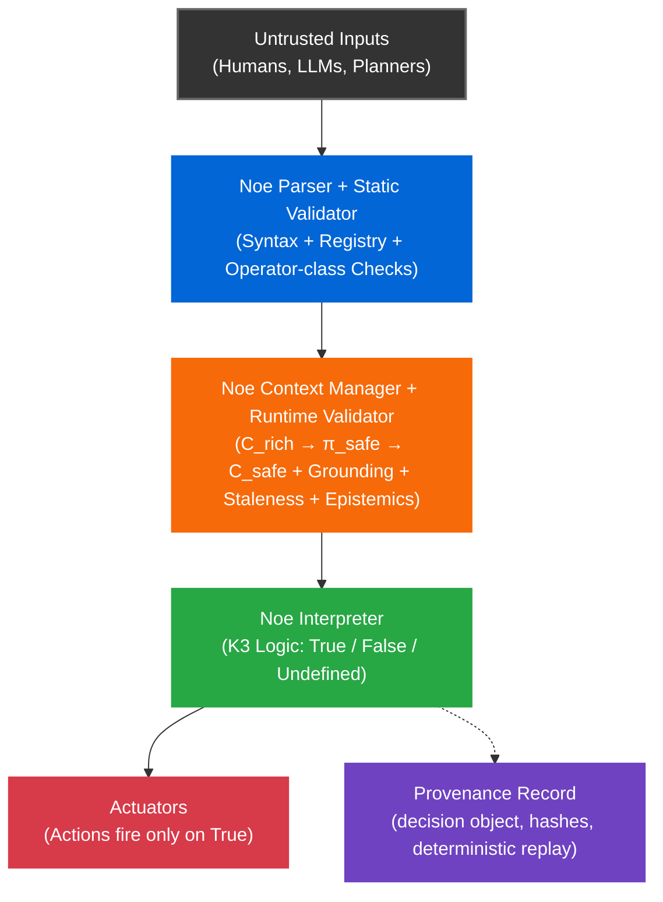

# Noe

**A Deterministic Decision Kernel for Autonomous Systems.**

Noe acts as a deterministic decision enforcement boundary between untrusted proposers (humans, LLMs, planners) and critical actuators for embodied AI. Unlike probabilistic models, Noe evaluates each proposal to either a truth value (**True/False/Undefined**) or a typed **Error**. Only **True** can permit execution. False, Undefined, and Error are all non-execution and are distinguishable in the provenance record.

**Scope:** Noe gates decisions; it is not a control loop. In production, Noe evaluates guard conditions and blocks unsafe actions, but a lower-level reflex controller must handle the "blocked" state safely.

> ⚠️ **Fail-Stop Model:** Noe blocks unsafe actions but does NOT guarantee liveness. Safe for deliberative planning with reflex layers. Unsafe as sole control for flight systems, rockets, or high-speed vehicles without fallback controllers.

Given the same **chain + registry + semantics + C_safe**, every valid Noe chain has:

* **Exactly one parse**
* **Exactly one meaning** (AST + operator semantics)
* **Exactly one evaluation outcome** across compliant runtimes

<br />

## Quick Start & Demo

### Run the Auditor Demo

Verify the simulated cryptographic ledger, fail-stop behavior, and tamper detection in under 10 seconds.

```bash
# 1. Install dependencies
pip install -r requirements.txt

# 2. Run the full verification suite (Unit + Conformance)
./run_demo.sh

# 3. Run the Liability Machine Proof (Auditor Demo)
cd examples/auditor_demo
./run_demo.sh
```

**What this proves:**

1. **Bit-identical determinism:** Replay produces identical hashes.
2. **Fail-Stop safety:** Stale sensors (>5s old) cause automatic refusal.
3. **Tamper Evidence:** Modifying the history breaks the cryptographic seal.

**[👉 Read the full Auditor Demo Walkthrough](examples/auditor_demo/README.md)**

<br />

## Why Noe?

Modern autonomous systems fail for predictable reasons. Noe solves the "Black Box" liability problem.

| Problem | Traditional Approach | **Noe Solution** |
|---------|---------------------|------------------|
| **Ambiguous conditionals** | Ad-hoc Python `if` statements | ✅ **Deterministic grammar** |
| **Stale sensor data** | Silent failures / Race conditions | ✅ **Explicit error codes (`ERR_*`)** |
| **Beliefs treated as facts** | Implicit assumptions | ✅ **Grounded epistemics** (`knowledge` vs `belief`) |
| **LLM hallucinations** | Hope-based validation | ✅ **Untrusted proposer model** (Undefined ⇒ Block) |
| **Agent liability** | "The AI messed up" (Unprovable) | ✅ **Provenance record** (SHA-256 Audit Log) |

**In practice:** Planners/LLMs propose → Noe gates → ROS2/controllers execute.

<br />

## Liability Infrastructure

Noe makes agent decisions replayable and auditable. For each proposal, it produces a deterministic verdict plus an integrity-protected record. This supports incident investigation, compliance workflows, and insurer-grade logging.

**What Noe provides:**

* **Deterministic evaluation:** Identical inputs → Identical verdict (Int64 only).
* **Cryptographic integrity:** Tamper-evident provenance hashes.
* **Replay capability:** Re-evaluate past decisions from frozen context.

**What Noe does NOT provide:**

* Guarantees of perception accuracy (sensor correctness is upstream).
* System-level safety guarantees (liveness is downstream).
* Legal liability determination (Noe generates *evidence*, not verdicts).

See [THREAT_MODEL.md](THREAT_MODEL.md) for adversary model, trust boundaries, and security limits.

<br />

## The LLM Problem: Safety Floors

Large Language Models (LLMs) are probabilistic. You cannot "replay" a neural network's thought process cryptographically.

Noe creates a **Safety Floor**: a deterministic, symbolic validation layer that sits *below* the LLM.

* **LLM Proposer:** *"I think we should release the pallet."*
* **Noe Kernel:** *"Checking bounds... Rejection. Confidence 0.85 < Threshold 0.90 (Knowledge)."*
* **Result:** Safe Halt.

This turns LLMs into **Untrusted Proposers**, preventing hallucinations from becoming kinetic actions.

<br />

## 🔒 Determinism Contract (Integer-Only)

**Reality:** Upstream sensors and planners emit floats (`1.23456`).
**Problem:** Floats are non-deterministic across architectures (x86 vs ARM).
**Noe Solution:** `C_safe` contains **only canonical int64 values**.

**Quantization Boundary:**
Sensor adapters MUST quantize floats → int64 **before** submitting to `π_safe`.

* **Standard scales:** 1e6 for position/velocity (micrometers, µm/s).
* **Validation:** The Kernel rejects any JSON float with `ERR_INVALID_NUMBER`.

This guarantees that a log captured on a robot (ARM) replays identically on a cloud server (x86).

<br />

## Engineering Constraints & Trade-offs

Noe is opinionated. We prioritize **Liability Management** over flexibility.

1. **"Modal Logic Theatre" (The Threshold Attack)**
   * *Critique:* "You are redefining 'Knowledge' as simply 'High Confidence'."
   * *Defense:* **Correct.** Noe does not solve Truth; it solves **Standard of Care**. By enforcing an explicit high threshold for `shi`, Noe provides a mathematically provable standard of care for legal defense.

2. **"The Latency Tax"**
   * *Critique:* "Cryptography is too slow for 1kHz loops."
   * *Defense:* **Correct.** Noe is a **Supervisor**, not a Reflex. You use Noe to decide *if* the robot enters the room (1Hz), not to balance the motors (1kHz).

3. **"Garbage-In, Signed-Garbage-Out"**
   * *Critique:* "If the sensor lies, Noe just signs the lie."
   * *Defense:* **Correct.** But by signing the lie, Noe **crystallizes it**. You can prove exactly *which* sensor caused the accident, shifting blame from the System Integrator to the Component Vendor.

<br />

## Architecture



[Full architecture specs →](nips/nip_005.md)

<br />

## Repository Structure

```text
noe/                    # Core runtime (parser, validator, context manager)
tests/                  # Unit tests + NIP-011 conformance vectors
examples/               # End-to-end demos (auditor, robot guard)
nips/                   # Specification documents (NIP-005, 009, 010)
```

<br />

## Documentation

* **[NIP-005: Core Semantics](nips/nip_005.md)** - Grammar + K3 logic
* **[NIP-009: Context Model](nips/nip_009.md)** - `C_root`, `C_domain`, `C_local`
* **[NIP-011: Conformance](tests/nip011/)** - 60/60 vectors passing
* **[ROS 2 Integration Pattern](docs/ros2_integration_example.md)** - Architecture guide

<br />

## License

Apache 2.0 - see [LICENSE](LICENSE)

<br />

## Contact

* **Issues**: [github.com/noe-protocol/noe/issues](../../issues)
* **Discussions**: [github.com/noe-protocol/noe/discussions](../../discussions)
