# Noe Auditor Demo

**Reference Standards:** [NIP-005](../../nips/nip_005.md) • [NIP-009](../../nips/nip_009.md) • [NIP-010](../../nips/nip_010.md) • [NIP-014](../../nips/nip_014.md)

This demo shows how Noe provides **cryptographically verifiable audit trails** for real-world decisions.

> **"This implements a deterministic execution certificate format for autonomous decisions, aimed at safety-critical domains."**

## Why This Demo Exists

Robotics and autonomous systems are entering regulation.
Regulators are moving toward regimes where every safety-relevant autonomous decision must:

  - Is reproducible
  - Is grounded in verifiable evidence
  - Can be audited after the fact
  - Cannot be falsified or fabricated

Noe provides this capability today. This demo shows a live, deterministic execution certificate for an autonomous decision system.

## What It Demonstrates

### 1. **Deterministic Decision Making**

  - Same canonical chain + same C_safe + same registry version + same mode → identical result
  - **Bit-identical replay** proven via certificates

### 2. **Spec-Compliant Context Grounding (Noe’s Context Model)**

  - Three-layer context architecture (Root / Domain / Local)
  - **Safety kernel (π_safe)**:
      - Removes stale sensor data
      - Strips probabilistic fields (confidence scores)
      - Ensures a clean epistemic state for evaluation

### 3. **Provenance Integrity (Noe’s Execution Certificates)**

  - SHA-256 over context layers, action, and outcome
  - Full context snapshot embedded for strict audit
  - Certificate format suitable for generic blockchain anchoring

## Running the Demos

### Quick Start (Recommended)

Run the full demonstration suite with a single command:

```bash
chmod +x run_demo.sh
./run_demo.sh
```

-----

### Demo 1: The Happy Path (Shipment Released)

**"Provenance & Auditability"**

Shows a successful decision with valid, fresh data.

```bash
cd examples/auditor_demo
export PYTHONPATH=../..
python3 verify_shipment.py
```

**The Logic Chain:**

```noe
shi @temperature_ok an shi @location_ok an shi @chain_of_custody_ok an shi @human_clear khi sek mek @release_pallet sek nek
```

**Outcome:**

  - **Certificate:** `shipment_certificate_strict.json`
  - **Replay:** Verifies logic is 100% deterministic (hashes match bit-for-bit).

-----

### Demo 2: The Epistemic Gap (Confidence Trap)

**"Preventing False Positives"**

Shows a scenario where the sensor is fresh but **noisy/uncertain** (Confidence: 0.85).

  - **Naive Agent:** Sees "85% confidence" and treats it as safe.
  - **Noe Protocol:**
      - `shi` (Knowledge) requires membership in knowledge set (mapped as ≥0.90 in this demo's grounding layer)
      - Below threshold → not in knowledge → `shi` returns false → **BLOCKS**
      - `vek` (Belief) permits lower threshold (≥0.40) but requires `@human_override`

**Visualizing the Logic Flow:**

```mermaid
graph TD
    subgraph SENSORS ["Sensor Array (C_local)"]
        L[✅ Location: BAY-07<br/>(Conf: 0.99)]:::pass
        C[✅ Custody: Valid<br/>(Conf: 1.0)]:::pass
        E[✅ Environmentals<br/>(Conf > 0.94)]:::pass
        T[⚠️ Temperature: 4.1°C<br/>(Conf: 0.85)]:::warn
    end

    subgraph LOGIC ["Noe Epistemic Logic"]
        K{"Knowledge Gate<br/>(shi: membership check)"}
        B{"Belief Gate<br/>(vek: membership check)"}
    end
    
    subgraph MAPPING ["Grounding Layer (Your Responsibility)"]
        M["Confidence ≥ 0.90 → knowledge<br/>Confidence ≥ 0.40 → belief<br/>Below → neither"]
    end

    L --> K
    C --> K
    E --> K
    T --> K
    T --> B
    
    K -- "❌ BLOCKED (0.85 < 0.90)" --> HALT["🔴 Auto-Release HALTED"]:::fail
    B -- "⚠️ High Risk (Belief Only)" --> OVERRIDE{"👤 Human Override?"}
    OVERRIDE -- "Yes" --> GO["🟢 Manual Release AUTHORIZED"]:::pass
    OVERRIDE -- "No" --> HALT

    classDef pass fill:#e6fffa,stroke:#00b894,stroke-width:2px,color:#004d40
    classDef warn fill:#fffde7,stroke:#fbc02d,stroke-width:2px,color:#f57f17
    classDef fail fill:#ffebee,stroke:#ef5350,stroke-width:2px,color:#b71c1c
```

```bash
export PYTHONPATH=../..
python3 verify_shipment_uncertain.py
```

-----

### Demo 3: The Safety Halt (Stale Sensor)

**"Temporal Safety"**

Shows what happens when one sensor (`@human_clear`) is 10 minutes old.

```bash
export PYTHONPATH=../..
python3 verify_shipment_stale.py
```

**Outcome:**

  - **Certificate:** Shows a safe halt due to stale data.
  - **Proof:** In this certificate, π_safe removed `@human_clear` from C_safe because its timestamp exceeded `max_skew_ms`. Under that C_safe, the chain evaluates to `domain: "undefined"`.
  - **Safety Invariant:** The implementation enforces the invariant `undefined ⇒ non-execution`.

-----

### Demo 4: The Hallucination Firewall

**"Cross-Modal Robotics Safety"**

Shows Noe blocking a dangerous action when a Vision Model confidently hallucinates a door, but Lidar confirms a wall.

```bash
export PYTHONPATH=../..
python3 verify_hallucination.py
# Output: hallucination_certificate_success.json (+ blocked variant)
```

**Scenario:**

  - **Vision Model (VLM):** Confidence 0.93 ("I see a door!") - *Hallucination*
  - **Lidar Sensor:** Depth 0.1m ("This is a solid wall.")

> [!NOTE]
> **Simulated Fusion**
> In this demo, the `@visual` and `@lidar` signals are simulated inputs into C_local to show how Noe fuses cross-modal evidence. In a deployed robot, these would be driven by a VLM and depth sensor.

**Chain (Single-Action Validation):**

```noe
shi @visual_door_detect an shi @lidar_depth_open khi 
sek 
    mek @nav2_maneuver
sek 
nek
```

> [!NOTE]
> **One Action Per Chain**  
> Per spec, one chain evaluates to ≤1 action. For multi-step maneuvers, use a composite action like `@nav2_maneuver{steps:[navigate, spin, drive]}` or coordinate multiple chains via a sequencer (future NIP).

**Outcome:**

1.  **Run 1 (Hallucination):** Vision says True, Lidar says False. `True AND False = False`. Action **BLOCKED**.
2.  **Run 2 (Real Door):** Vision says True, Lidar says True. `True AND True = True`.
      - **Atomic Commit:** The navigation maneuver is committed as a single action package.

-----

### Demo 5: Liveness Policy Example (Above Noe)

**"Liveness via Graceful Degradation"**

This scenario shows how a runtime can orchestrate Noe-validated decisions into a Green/Yellow/Red policy. **The Noe kernel is unchanged; this is a separate layer.**

```bash
export PYTHONPATH=../..
python3 verify_multi_agent.py
```

**Visualizing the Decision Tree:**

```mermaid
graph TD
    A[Robot A Proposal] -->|shi @clear| ARB{Arbiter Logic}
    B[Robot B Status] --> ARB

    ARB -->|shi Agreement| GREEN[🟢 GREEN STATE<br/>Speed: 1.5 m/s]:::pass
    ARB -->|nai Agreement + nai Veto| YELLOW[🟡 YELLOW STATE<br/>Speed: 0.1 m/s + Beep]:::warn
    ARB -->|shi Veto| RED[🔴 RED STATE<br/>STOP + Escalate]:::fail

    classDef pass fill:#e6fffa,stroke:#00b894,stroke-width:2px,color:#004d40
    classDef warn fill:#fffde7,stroke:#fbc02d,stroke-width:2px,color:#f57f17
    classDef fail fill:#ffebee,stroke:#ef5350,stroke-width:2px,color:#b71c1c
```



**The Logic (Three Tiers):**

1.  **GREEN (High Speed):** Unanimous Agreement.
      - *Action:* `SET_SPEED_1.5` (m/s)

2.  **YELLOW (Creep Mode):** Graceful Degradation.
      - *Condition:* A sees "Clear", but B is "Uncertain" or Silent.
      - *Action:* `SET_SPEED_0.1` (m/s) + `BEEP_BEEP`

3.  **RED (Safety Stop):** Explicit Conflict.
      - *Condition:* B explicitly detects a human.
      - *Action:* `STOP_IMMEDIATE` + `CALL_HUMAN`

-----

## Why This Matters

**"How do we know the AI won't hallucinate and make wrong decisions?"**
→ These demos show Noe enforcing a deterministic **Safety Floor**. When context is bad, the system refuses to execute.

**"How can we verify the system did what it claims?"**
→ Each certificate contains the chain, the safe context snapshot, and the outcome, with stable hashes over all three. Replay is mechanical and deterministic.

-----

## Embodied AI and LLM Governance

These demos are written in Python, but the target environment is embodied AI – robots driven by large models and rich sensor suites.

A natural question is:

> "If I already have an LLM, ROS, and some Python safety code, why do I need Noe at all?"

When an LLM starts proposing actions for a real robot, three problems appear:

1. The model is probabilistic and changes over time.
2. The robot’s world state is spread across many subsystems (maps, joint states, sensor topics).
3. Safety checks end up scattered through ad hoc `if` statements tied to one codebase.

Noe addresses this by imposing a hard structure:

- **LLMs become proposers.** They are allowed to *suggest* Noe chains, not drive motors directly.
- **Noe runs on a structured embodied context.** Kinematics, geometry, and sensor signals are projected into a three-layer context and then into a cleaned `C_safe` snapshot. This is the only state the validator trusts.
- **The validator is deterministic and versioned.** Given a chain and `C_safe`, the outcome is fixed. The execution certificate captures this boundary, so you can replay and audit decisions even if the underlying LLM or ROS stacks have changed.

You can write safety logic in plain Python if you have a single robot and total control of the code. Noe shows how to do this in a way that stays deterministic, auditable, and shared once you have:

- multiple robots and vendors,
- a changing family of LLMs,
- and external auditors who need to verify decisions without reading your entire codebase.

-----

## Is This Just `if (safe) do_action(); log(context);` in Python?

A fair, hostile question:

> **"Couldn’t I just write `if (safe) do_action(); log(context);` in Python and be done? Why do I need Noe at all?"**

You can approximate pieces of this with ad hoc code, but you do not get the same guarantees once you have multiple robots, multiple vendors, or external auditors.

Noe is not about adding new instructions. It is about **standardizing** how safety logic, context, and evidence are represented, so that anyone can replay and verify a decision without reverse-engineering each codebase.

### Example: One Incident, Three Vendors

Imagine a near miss in a shared facility:
  - Robot A from Vendor 1
  - Robot B from Vendor 2
  - A mobile base from Vendor 3

Six months later an auditor asks: **"Why did the arm move when a human was near? Can this happen again?"**

#### With Ad Hoc Python and Logs
Each vendor has:
  - Its own `if (safe)` logic
  - Its own log format
  - Its own notion of `human_clear`
  - Its own upgrade history

To reconstruct the incident you must:
  - Pull three different log formats
  - Reverse-engineer three safety implementations
  - Hope semantics did not change across versions
  - Manually align which fields were used for which safety checks

You can get an answer, but it is costly, brittle, and hard to repeat.

#### With Noe's Context Model and Execution Certificates
All three systems share:
  - The same safety chain (Noe logic)
  - The same context structure (Root / Domain / Local and the derived Safe context)
  - The same execution certificate format for each decision

For the incident there is one artifact per decision:
  - `chain`: the exact safety rule evaluated
  - `C_safe`: the cleaned context that was trusted at decision time
  - `outcome`: the action (or halt) result
  - `hashes`: cryptographic commitments over the above

Replay is:

```python
result = run_noe_logic(
    cert["chain"],
    cert["context_snapshot"]["safe"],
    mode="strict",
)

assert result["domain"] == cert["outcome"]["domain"]
assert result["value"]  == cert["outcome"]["value"]
```

If these match, you have mechanical proof of what the system did and why.
If they do not match, you have a precise, inspectable divergence.

### What Noe Adds Beyond Raw Python

You can think of Noe as formalizing four things that are usually hand-rolled and inconsistent:

1.  **Shared Rule Language**
    Safety logic is a chain in a small, fixed language rather than scattered `if` statements across services. The same chain can run on different robots and in different organizations.

2.  **Canonical Context Model**
    Every decision consumes the same structured context (Root / Domain / Local and Safe). Staleness, conflicts, and probabilistic fields are handled by a standard safety kernel rather than per-team heuristics.

3.  **Deterministic Serialization and Hashing**
    Canonical JSON plus hash rules make replay and comparison precise. Any change in even one bit of the context or outcome is visible.

4.  **Execution Certificates**
    Each decision produces a single evidence object that can be archived, shared with auditors, and replayed later. This is not just a log line; it is a self-contained proof of what was executed.

### When is Noe Overkill?

If you have:
  - One robot
  - One codebase
  - One team
  - No external auditors

then careful Python, tests, and structured logs can go quite far.

Noe becomes useful once you care about cross-system determinism and auditability:
  - Multiple vendors or sites
  - Long-lived deployments where semantics must not drift silently
  - Situations where an external party needs to verify decisions without reading your entire codebase

In that setting Noe is not "fancier if-logic." It is:

> A shared deterministic way to encode **what counted as safe**, **what the world looked like**, and **what the system actually did**, in a form that anyone can replay and verify.

-----

## The LLM Problem: Why Replay is Impossible for Chatbots

Large Language Models (LLMs) are probabilistic. If you ask an LLM to "release the pallet," it might do it today but refuse tomorrow because the temperature phrasing was slightly different. **You cannot "replay" a neural network's thought process cryptographically.**

Noe is different. It creates a **Safety Floor**: a deterministic, symbolic validation layer that sits *below* the LLM.

  - **LLM:** *"I think we should release the pallet."*
  - **Noe:** *"Checking bounds... Rejection. Confidence 0.85 < Threshold 0.90 (Knowledge)."*
  - **Result:** Safe Halt (Epistemic Gap).

> [!NOTE]
> **What a Noe Certificate Proves Cryptographically**
>
> A valid Noe execution certificate guarantees:
>
> 1.  This exact chain was evaluated.
> 2.  Under this exact safe context snapshot C_safe.
> 3.  Using frozen semantics (NIP-005), context model (NIP-009), provenance schema (NIP-010), and validator rules (NIP-014).

-----

## How to Read a Noe Execution Certificate

A Noe certificate is a frozen evidence object: it tells you exactly what symbolic program ran, on exactly which context, and what the deterministic outcome was. This section shows how to interpret it.

Below is a simplified example (shortened for readability):

```json
{
  "noe_version": "v1.0-rc",
  "created_at": "2025-12-11T06:42:19Z",

  "chain": "shi @temperature_ok an shi @location_ok an shi @chain_of_custody_ok an shi @human_clear khi sek mek @release_pallet sek nek",

  "context_hashes": {
    "root":   "9f3a1b7c2e8d4a1f...",
    "domain": "7c0d9e12bb34a8c5...",
    "local":  "b1f20cd5e9912aa0...",
    "safe":   "4c8d2e19a7b3f0c1..."
  },

  "context_snapshot": {
    "root":   { "...": "..." },
    "domain": { "...": "..." },
    "local":  { "...": "..." },
    "safe":   { "...": "..." }
  },

  "outcome": {
    "domain": "action",
    "value": {
      "type": "action",
      "verb": "mek",
      "target": "@release_pallet",
      "args": {},
      "action_hash": "2a7b91f0c3d4e5a6..."
    }
  },

  "evaluation": {
    "mode": "strict",
    "runtime": "python-reference",
    "nip": ["NIP-005", "NIP-009", "NIP-010", "NIP-014"],
    "note": "NIP-014 = Validator & Strict Mode (not deixis)"
  }
}
```

You can think of this as five main blocks:

1.  **Header:** Which implementation and version produced this.
2.  **Chain:** Which rule was actually executed.
3.  **Context Hashes:** Which world-state the system trusted.
4.  **Context Snapshot:** What the robot "knew" at that moment.
5.  **Outcome:** What it decided and what was allowed to happen.

**Replay is as described above:** load the chain and C_safe, run the interpreter in strict mode, and compare both the semantic result and the action hash.

If they match, you have a reproducible, deterministic explanation of the decision. If they do not, you know something about the environment, the runtime, or the configuration has changed.

-----

## Engineering Constraints & Trade-offs

Noe is an opinionated system. It makes specific engineering trade-offs to prioritize safety and liability management over raw performance or "absolute truth."

We acknowledge these constraints openly, as they define the system's true market fit.

### 1. "Modal Logic Theatre" (The Threshold Attack)
* **Critique:** "You are redefining 'Knowledge' as simply 'High Confidence.' You haven't actually solved the philosophical problem of Truth."
* **Assessment:** **True.** Noe does not solve Truth; it solves **Standard of Care**.
* **The Value:** The legal system does not require "Absolute Truth"; it requires *Reasonable Care*. By enforcing an explicit high threshold before a signal becomes "Knowledge," Noe provides a mathematically provable standard of care. Noe doesn't sell Truth; it provides **Liability Protection**.

### 2. "The Latency Tax" (The Performance Attack)
* **Critique:** "Cryptography and parsing are slow. You cannot run Noe inside a 1kHz motor control loop."
* **Assessment:** **True.** Noe is not a reflex; it is a **Supervisor**.
* **The Value:** You don't use Noe to balance the robot (1kHz). You use Noe to decide *if* the robot is allowed to enter the room (1Hz). The "Tax" is negligible for high-level, liability-bearing decisions.

### 3. "Garbage-In, Signed-Garbage-Out" (The Oracle Attack)
* **Critique:** "If the sensor lies before it hits Noe, Noe just signs the lie."
* **Assessment:** **True.** Noe guarantees the *process*, not the *input*.
* **The Value:** By signing the "Lie," Noe crystallizes it. 

> [!NOTE]
> **Hardware Signatures in this Demo**
> This demo uses a **Simulated Hardware Signature Verification** stub to show where secure sensors plug into Noe. It does not perform real TPM/HSM attestation. In a production environment, this hook enforces hardware-backed attestation (e.g., TPM/HSM signatures). In this demo, it simulates verification to demonstrate how untrusted data is mathematically excluded from Noe's epistemic state (resulting in a safe halt), without requiring actual secure hardware.

You can prove **exactly which sensor lied** and when. Without Noe, the lie is lost in a sea of logs. With Noe, you have a signed confession from the sensor component, shifting blame from the System Integrator to the Component Vendor.

### 4. "Language of Babel" (The Integration Attack)
* **Critique:** "Integrating with every vendor (Fanuc, Kuka, UR) is painful."
* **Assessment:** **True.** Integration is the primary cost.
* **The Value:** You don't translate *everything*—only the **Safety Signals** (human present, door open, error state). The pain of integration is high, but the pain of a fleet-wide **recall** is higher. Enterprises pay for this "Sidecar" integration to prevent catastrophic failure.